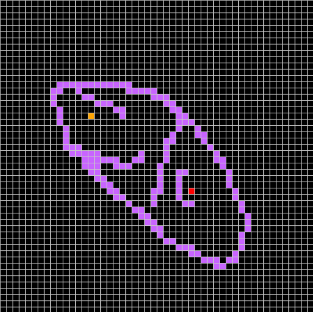
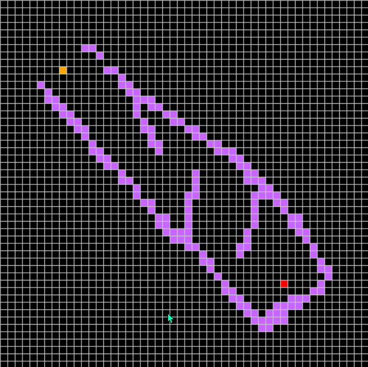
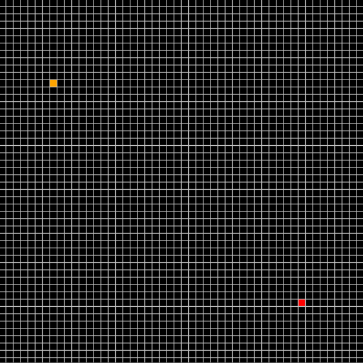

# Background

> A* (pronounced "A-star") is a graph traversal and path search algorithm, which is often used in many fields of computer science due to its completeness, optimality, and optimal efficiency.
> — _referenced from Wikipedia_

`Worst-case Time Complexity:` =O(b^{d}))

`Worst-case Space Complexity:` =O(b^{d}))

 

As an informed variation of Dijkstra, `A*` is considered a `best first search` because it greedily chooses which vertex to explore next, according to the value of =h(v)%20%2B\%20g(v)), where  is the heuristic and  is the cost so far.

## Python Implementation

